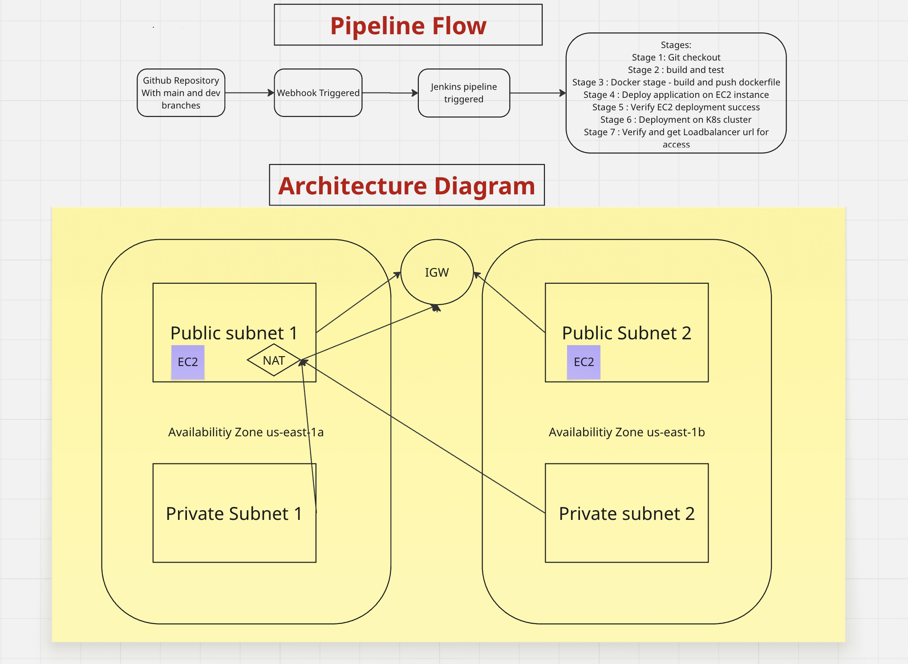

Absolutely! Based on your detailed workflow, here’s a polished **README.md** you can use for your GitHub repository. I’ve structured it clearly with the architecture diagram, setup instructions, and pipeline explanation. You can update the diagram path as needed.

---

````markdown
# DevOps Task: CI/CD Pipeline for Node.js Application

## Overview
This repository contains a sample Node.js application along with the necessary configurations to implement a CI/CD pipeline using **Jenkins**, **Docker**, **AWS EKS**, and **Terraform**. The pipeline automates building, testing, containerizing, and deploying the application to a Kubernetes cluster.

---

## Architecture Diagram
Below is the architecture of the CI/CD pipeline:



**Description:**
1. Source code is stored in **GitHub**.
2. **Jenkins** is used to automate the CI/CD pipeline.
3. Docker images are built and pushed to **DockerHub**.
4. **AWS EKS** hosts the Kubernetes cluster where the application is deployed.
5. **Terraform** is used to provision AWS infrastructure (VPC, subnets, EC2 instances, security groups, and EKS cluster).
6. Webhooks trigger Jenkins pipeline automatically on code push.

---

## Setup Instructions

### 1. AWS & Terraform Setup
1. Launch an **EC2 instance** and attach an **IAM role** with `AdministratorAccess`.
2. Install required tools on the EC2:
   - Terraform
   - Docker
   - kubectl
   - eksctl
   - AWS CLI
   - Jenkins
3. Write Terraform files to provision:
   - VPC, Subnets, IGW, NAT, Route Tables
   - Security Groups
   - EC2 instances
4. Apply Terraform configuration:
   ```bash
   terraform init
   terraform apply -auto-approve
````

### 2. Docker Setup

1. Clone the GitHub repository:

   ```bash
   git clone <your-repo-url>
   ```
2. Create a `Dockerfile` and test the image locally:

   ```bash
   docker build -t devops-task:latest .
   docker run -p 3000:3000 devops-task:latest
   ```
3. Create a **DockerHub repository** and push the image:

   ```bash
   docker login
   docker tag devops-task:latest <dockerhub-username>/devops-task:latest
   docker push <dockerhub-username>/devops-task:latest
   ```

### 3. Kubernetes & EKS Setup

1. Create an EKS cluster using **eksctl**:

   ```bash
   eksctl create cluster -f terraform/cluster.yaml
   ```
2. Write Kubernetes manifests (`deployment.yaml` and `service.yaml`) in the `k8s/` folder.
3. Test deployment manually:

   ```bash
   kubectl apply -f k8s/deployment.yaml
   kubectl apply -f k8s/service.yaml
   kubectl get pods
   kubectl get svc
   ```

### 4. Jenkins Pipeline Setup

1. Login to the Jenkins server and install required plugins:

   * GitHub
   * Docker Pipeline
   * Kubernetes CLI
   * AWS CLI (optional)
2. Add credentials:

   * GitHub
   * DockerHub
   * Kubernetes token / kubeconfig
3. Create a Jenkins pipeline and store `Jenkinsfile` in `jenkins/` folder.
4. Setup GitHub webhook to trigger the pipeline on code push.

---

## CI/CD Pipeline Flow

1. **Code Checkout**
   Jenkins clones the repository whenever there is a push to GitHub (via webhook).

2. **Build & Test**

   * Installs dependencies using `npm ci`.
   * Runs application tests.

3. **Dockerize**

   * Builds the Docker image from the `Dockerfile`.
   * Tags the image with the build number.
   * Pushes the image to DockerHub.

4. **Deploy to EKS**

   * Jenkins applies Kubernetes manifests (`deployment.yaml` & `service.yaml`) to the EKS cluster.
   * Updates deployments and services automatically.

5. **Monitoring**

   * Application logs can be accessed via `kubectl logs <pod-name>` or through AWS CloudWatch (if configured for Container Insights).

---

## Additional Files

* `.dockerignore` — to exclude unnecessary files from Docker image.
* `Terraform/` — Terraform scripts for AWS infrastructure.
* `K8s/` — Kubernetes deployment and service manifests.
* `jenkins/` — Jenkins pipeline definition.
* `deployment-proof/` — screenshots and proof of successful deployment.

---
